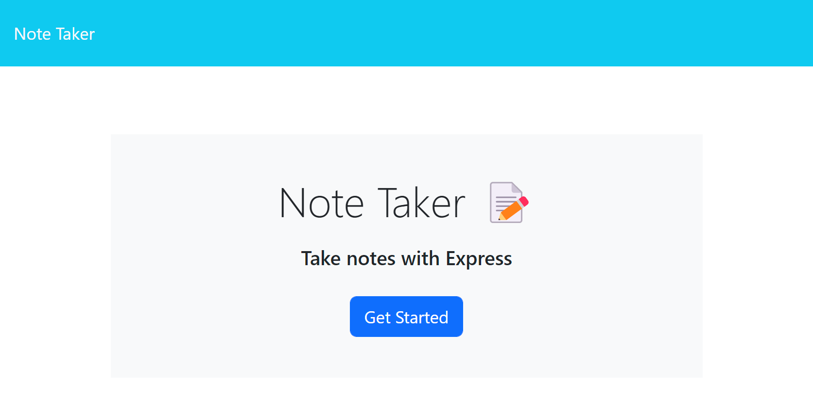
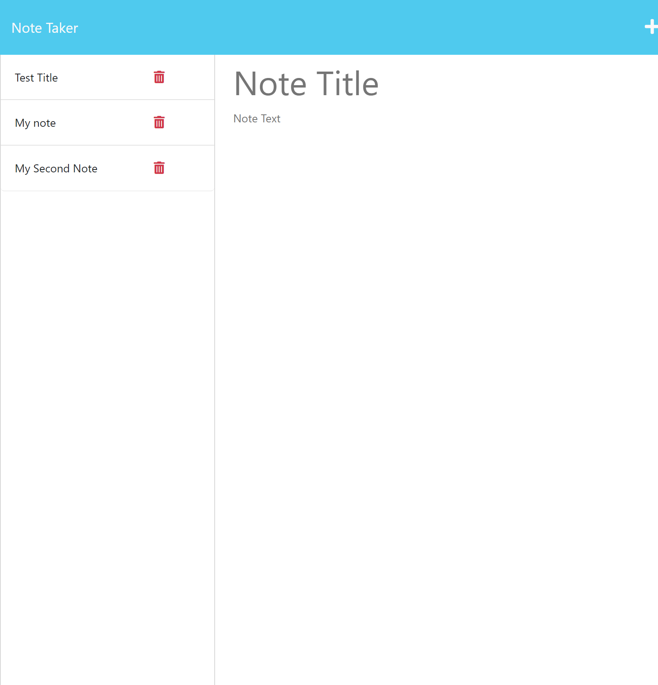

# express-note-taker

[Deployed Application Link](https://express-note-taker-production.up.railway.app/notes)

##
This is a application that allows you to create/save notes. Once you begin to write in the body of the new note you can save it. All of your previous notes are stored on the left side of the page, and when you click on them they display. You also have the ability to delete any note.

## Visuals

